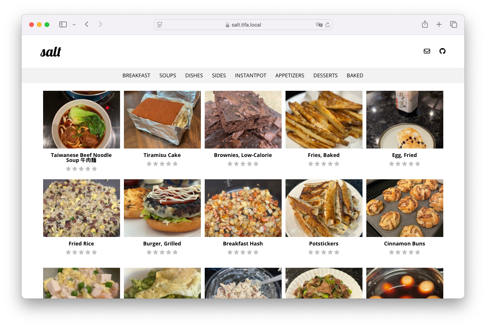

# paprika-pages 🌶️

Sync from an app-only [Paprika Recipe Manager 3] account to create a shareable website.

[][demo]


## Setup

Copy and configure these two config files.

```sh
cp .env.example .env
cp config.toml.example config.toml
```

Bring up the service.

```sh
make build
make start
```

Manually sync for the first time.

```sh
make sync
```

## Maintenance Mode

Place the site in maintenance mode.

```sh
make down
```

Disable maintenance mode.

```sh
make up
```

<!-- Links -->
[demo]: https://salt.tifa.dev
[Paprika Recipe Manager 3]: https://www.paprikaapp.com
